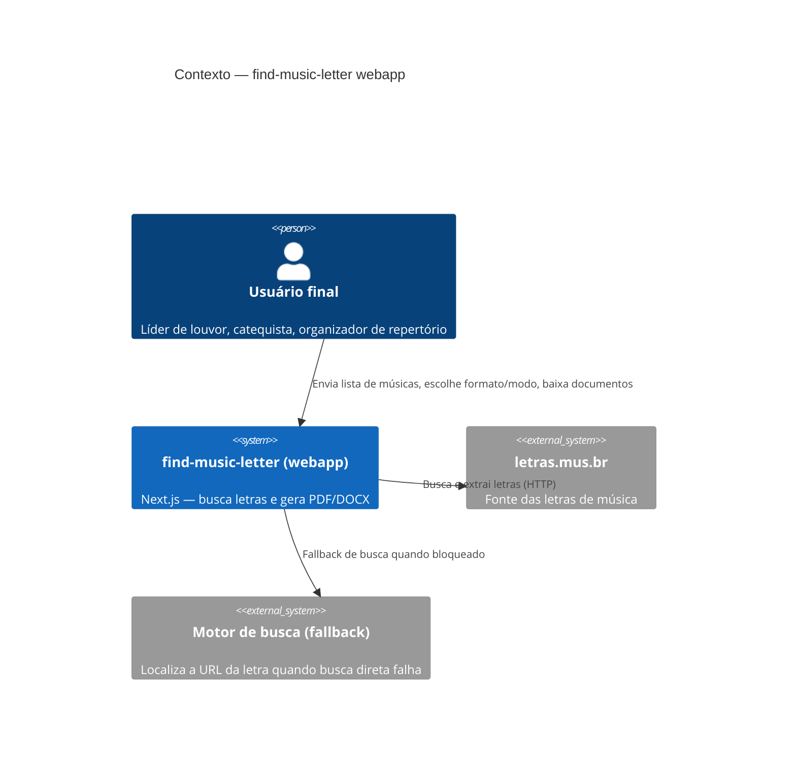
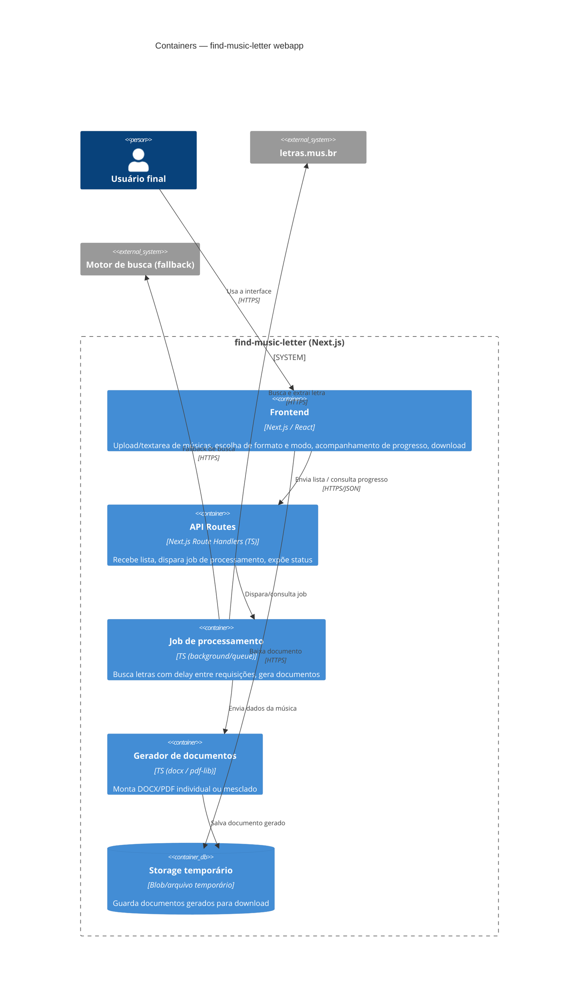

# criteria-89a1-webapp-nextjs

## Restrições
- **Stack alvo:** Next.js (App Router) + TypeScript. Sem runtime Python — toda a lógica hoje em `find_lyrics.py` precisa ser portada para TS.
- **Deploy serverless (ex: Vercel):** funções serverless têm timeout curto. Como o fluxo atual usa `DELAY_SECONDS = 1.5s` entre requisições (para não sobrecarregar o letras.mus.br), uma lista de N músicas pode levar bem mais que o limite de uma função síncrona. O processamento precisa rodar como job assíncrono, com a UI consultando progresso (polling ou streaming), não como request-response direto.
- **Bypass anti-bot:** o script atual usa `curl_cffi` com impersonation de TLS fingerprint (`impersonate="chrome124"`) para contornar Cloudflare. Bibliotecas Node não replicam TLS fingerprinting da mesma forma — a reescrita deve usar headers HTTP realistas e o fallback de busca (equivalente ao `ddgs`) como mitigação. Risco de taxa de bloqueio diferente do script Python deve ser aceito e monitorado, não é um "mesmo funcionamento" garantido bit-a-bit.
- **Parsing do arquivo de entrada:** manter exatamente o formato hoje aceito — `Artista - Música` por linha, linhas vazias e iniciadas com `#` ignoradas, linha sem `" - "` tratada como apenas título (artista descoberto via busca).
- **Layout dos documentos:** manter o layout visual atual — título (20pt, negrito, centralizado), artista (13pt, itálico, centralizado), divisória, corpo da letra; PDF em 2 colunas com numeração de página no rodapé; DOCX com quebra de página entre músicas.

## Critérios de aceitação (executáveis)
1. Upload de `.txt` no formato atual **ou** colar lista na textarea é aceito e parseado de forma idêntica (mesmas regras de `#`, linha vazia, `Artista - Música` vs. apenas título).
2. Usuário escolhe o formato de saída (PDF ou DOCX) via interface antes de iniciar o processamento.
3. Usuário escolhe o modo de saída via interface: arquivo único mesclado (todas as músicas, quebra de página entre elas) ou arquivos separados (download em lote/zip).
4. O processamento roda de forma assíncrona (job em background), com feedback de progresso na UI (ex: "3/10 músicas processadas") sem estourar timeout de função serverless.
5. Ao concluir, a UI disponibiliza link(s) de download do(s) documento(s) gerado(s).
6. Falha ao encontrar uma música específica não interrompe o processamento das demais; o resultado final lista quais músicas falharam (equivalente ao `[NÃO ENCONTRADO]` do CLI).
7. O intervalo mínimo entre requisições ao site de origem é preservado na versão web.

## C4 Model — Contexto

## C4 Model — Containers

