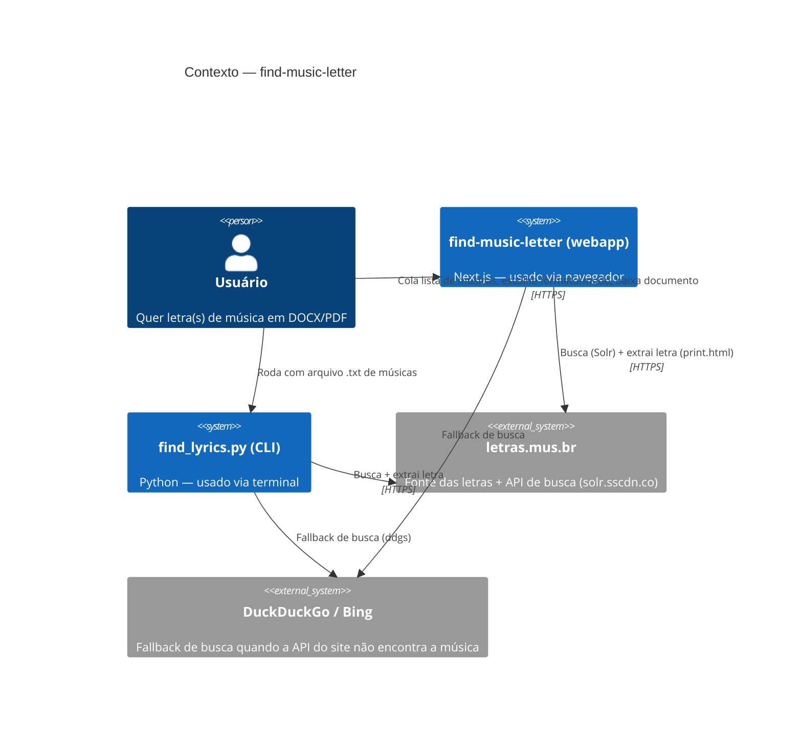
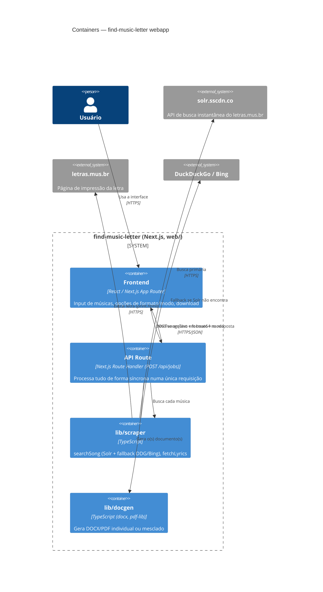

# Overview — find-music-letter

Busca letras de música e gera documentos DOCX/PDF prontos pra estudar ou imprimir. Existe como script CLI (Python, raiz do repo) e como webapp (Next.js, `web/`) — o webapp é a porta ativa, pensada pra quem precisa montar repertório sem rodar comando (ex: cantores que aprendem música nova pra cada apresentação).

## Índice
- `stack.md` — tecnologias
- `modules.md` — componentes
- `flows.md` — fluxos principais
- `decisions.md` — decisões de design

---

## Arquitetura (C4 Model)

### Nível 1: Contexto

### Nível 2: Containers (Webapp)

